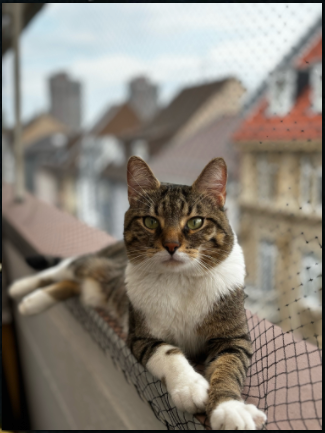
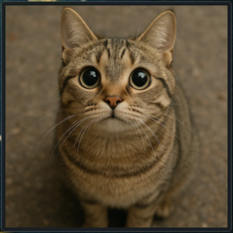
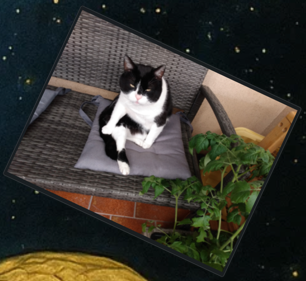

<div align="center">

  <h1>KPictureFrame</h1> <p><strong>Version: 0.0.1</strong></p>
  <a href="https://kde.org/de/">
  
</a>
 <a href="https://www.gnu.org/licenses/gpl-3.0.html">
  
</a>
  <a href="https://paypal.me/agundur">
  
</a>
  </a>
  <a href="https://store.kde.org/p/2290729">
  

<noscript><a href="https://liberapay.com/Agundur/donate"></a></noscript>
</a></div>


# KPictureFrame

**KPictureFrame** is a lightweight KDE Plasma 6 widget that displays a user-defined image in a Plasmoid – ideal for embedding personal photos, logos, QR codes directly onto your desktop.

 <!-- Optional, if you provide a screenshot -->

---

## Features

- 🖼️ Display any local image (PNG, JPG, SVG)
- 🖱️ Drag & Drop image support
- 🧩 Fully integrated into Plasma 6 (QML-based)
- 🔁 Live reload when configuration changes
- 🧰 Minimal dependencies, no external daemons

## Visuals




## Installation

**system wide installation**

mkdir build && cd build

cmake ..

make

make install (as root) 

## 🛠️ Installing KPictureFrame via the openSUSE Build Service Repository

[](https://build.opensuse.org/package/show/home:Agundur/kpictureframe)

For openSUSE Tumbleweed (and compatible systems):

```bash
# Add the repository
sudo zypper ar -f https://download.opensuse.org/repositories/home:/Agundur/openSUSE_Tumbleweed/home:Agundur.repo

# Automatically import GPG key (required once)
sudo zypper --gpg-auto-import-keys ref

# Refresh repository metadata
sudo zypper ref

# Install KCast
sudo zypper in kpictureframe
```