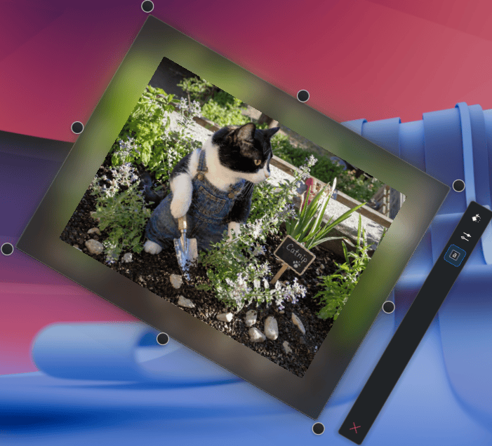
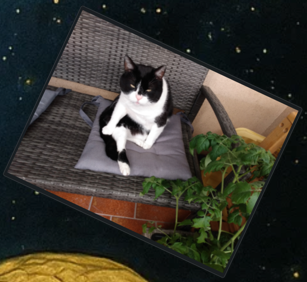
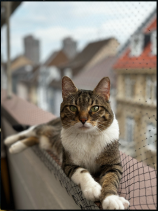

<div align="center">
  <h1>KPictureFrame</h1>
  <p>KDE Plasma 6 widget that displays a picture on your desktop.</p>
  <a href="https://kde.org/de/">
    
  </a>
  <a href="https://www.gnu.org/licenses/gpl-3.0.html">
    
  </a>
  <a href="https://build.opensuse.org/package/show/home:Agundur/KPictureFrame">
    
  </a>
  <a href="https://paypal.me/agundur">
    
  </a>
  <a href="https://liberapay.com/Agundur/donate">
    
  </a>
</div>

**KPictureFrame** is a lightweight KDE Plasma 6 widget that displays a
user-defined image directly on your desktop or panel — a photo, a logo, a
QR code, whatever you drag onto it.





## What it does

- **Display any local image** (PNG, JPG, WebP, SVG).
- **Drag & drop** an image straight onto the widget to set it.
- **Live reload** — changing the picture in Settings updates immediately,
  no restart needed.
- Pure QML, no compiled plugin, no external daemons.

## Requirements

Qt ≥ 6.7 and KDE Frameworks ≥ 6.10 (whatever your Plasma 6 install already
has) — nothing else to install at runtime.

## Install

Easiest: **"Get New Widgets"** in System Settings, or grab the `.plasmoid`
from the [latest release](https://github.com/Agundur-KDE/KPictureFrame/releases/latest)
and:
```bash
kpackagetool6 --type Plasma/Applet --install kpictureframe-*.plasmoid
```

Also available as a proper package, if you'd rather have `zypper`/`apt`
manage updates:
```bash
# openSUSE Tumbleweed
sudo zypper ar -f https://download.opensuse.org/repositories/home:/Agundur/openSUSE_Tumbleweed/home:Agundur.repo
sudo zypper --gpg-auto-import-keys ref
sudo zypper in kpictureframe

# Debian/Ubuntu — grab the .deb from the latest release above
```

Or straight from source, no build step needed:
```bash
git clone https://github.com/Agundur-KDE/KPictureFrame.git
kpackagetool6 --type Plasma/Applet --install KPictureFrame/package/
```

## Support

Open an issue: [KPictureFrame Issues](https://github.com/Agundur-KDE/KPictureFrame/issues)

## Contributing

Fork and adapt freely.

## License

GPL-3.0-or-later
